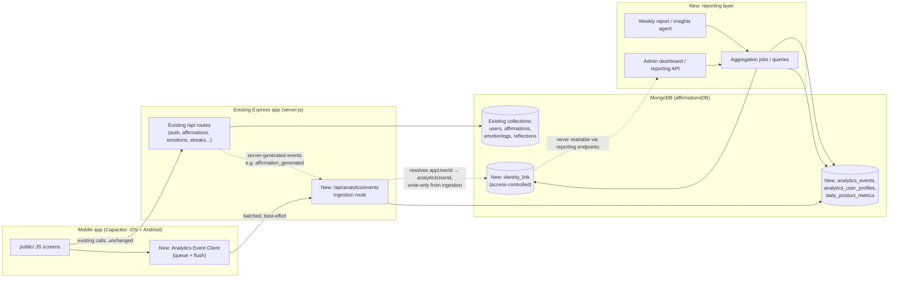
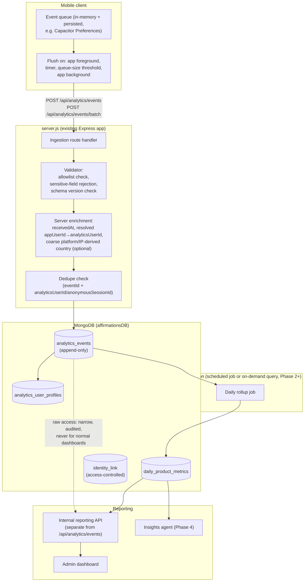
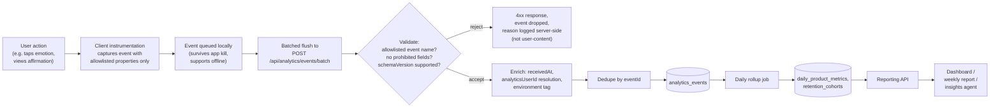
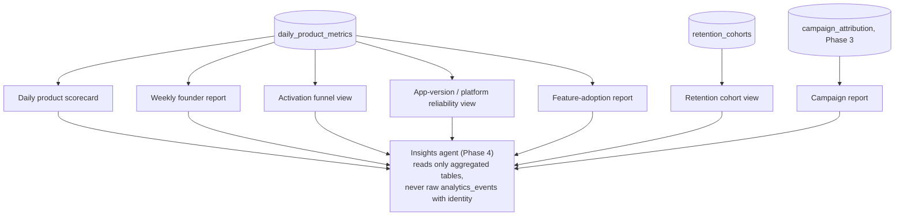
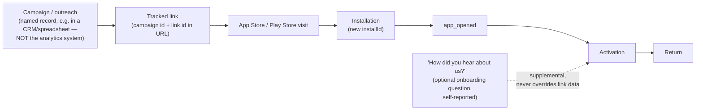

# Product Analytics — Proposed Architecture

Status: **proposal — nothing in this document has been implemented.**
See [CURRENT_STATE.md](PRODUCT_ANALYTICS_CURRENT_STATE.md) for what exists today and the standing caveat about backend drift (§0 there applies to everything in this file).

---

## 1. Design goals (recap)

1. Measure behavior (what happened, when, in what order), not identity.
2. Keep analytics data logically separate from the `users`/`affirmations`/`emotionlogs`/`reflections` collections that hold private content.
3. Never let analytics failure block the affirmation experience.
4. Fit the app's actual current scale and stack (Express + MongoDB, no queue infra today) — expand later without a rewrite.

---

## 2. Context diagram



Key point encoded in the diagram: the reporting/dashboard layer reads aggregated `daily_product_metrics` and (for narrow, access-controlled cases) raw `analytics_events`, but **never** reads `identity_link` — that table exists solely so account-deletion and abuse-investigation tooling can resolve `appUserId → analyticsUserId` under separate, audited access, not so dashboards can.

---

## 3. System architecture diagram



---

## 4. Data-flow diagram



---

## 5. Identifier design

### 5.1 Identifiers and their purpose

| Identifier | Generated by | Lifecycle | Appears in analytics storage? |
|---|---|---|---|
| `analyticsUserId` | Server, on first event for a given app identity (account or guest) | Persists for the life of the underlying app identity; rotated/replaced on account deletion (see §5.4) | **Yes** — the primary subject key in `analytics_events`/`analytics_user_profiles` |
| `anonymousSessionId` | Client, at app-session start | Lives for one bounded app session (see [Functional Spec §Session model](PRODUCT_ANALYTICS_FUNCTIONAL_SPEC.md)); new value each session | Yes — used for funnel/session-scoped analysis |
| `installId` | Client, once on first app launch after install | Persists across app restarts and logout/login on the same device; **does not** survive uninstall/reinstall (stored in platform-appropriate durable-but-uninstall-cleared storage, e.g. Keychain/EncryptedSharedPreferences, mirroring the existing `ig-device-id` pattern in `secure.store.js`) | Yes — install-level identifier, never derived from hardware/advertising IDs |
| Existing app user id (`currentUserId`, a Mongo `ObjectId`) | Existing backend (account) or existing client guest-bootstrap (guest) | Existing lifecycle, unchanged | **No** — never written into `analytics_events`. Only appears in `identity_link`, access-controlled |
| `eventId` | Client (or server, for server-generated events) | One per event, used for dedup | Yes — required field |
| Deduplication key | Derived as `eventId` (primary) with a fallback composite of `(analyticsUserId or anonymousSessionId, eventName, occurredAt rounded to second, key properties)` for events a client might legitimately double-send without a stable `eventId` (rare; prefer always generating `eventId`) | N/A | N/A — used only in ingestion logic, not stored as a separate field |
| Correlation/request ID | Existing or new HTTP-request-scoped id, for tying an ingestion request to backend logs | Per HTTP request | No — operational/log-only, not an analytics event field |

### 5.2 Why not derive `analyticsUserId` from the existing app user id directly
The existing `currentUserId` is already a persistent, cross-session, guest-inclusive identifier used directly in API calls (`?userId=<id>`) and stored in plaintext in `localStorage`/`currentUser`. Reusing it as `analyticsUserId` would make analytics trivially re-identifiable to anyone with API/DB access — defeating the entire point of a separate analytics identity. Instead, `analyticsUserId` is a **new, random, opaque UUID minted specifically for analytics**, linked to the app identity only through `identity_link` (see [DATA_MODEL.md](PRODUCT_ANALYTICS_DATA_MODEL.md#identity_link)).

### 5.3 Identifier lifecycle scenarios

```mermaid
sequenceDiagram
    participant App as Mobile app
    participant Ing as Ingestion API
    participant Link as identity_link (access-controlled)
    participant Events as analytics_events

    Note over App: First install, before any login
    App->>App: Generate installId, anonymousSessionId
    App->>Ing: app_opened (installId, anonymousSessionId, analyticsUserId=null)
    Ing->>Events: write event (analyticsUserId=null → "unlinked" bucket)

    Note over App: User completes guest bootstrap (existing 3-path logic, unchanged)
    App->>Ing: emotion_selected (installId, appUserId=guest-24hex via existing auth, NOT sent as analytics property)
    Ing->>Link: lookup-or-create analyticsUserId for this appUserId
    Link-->>Ing: analyticsUserId = X
    Ing->>Events: write event (analyticsUserId=X)

    Note over App: Guest registers an account (same device, same session)
    App->>Ing: account_created (appUserId=new-24hex)
    Ing->>Link: does old guest appUserId already map to analyticsUserId X? if so, reuse X for the new appUserId too (merge)
    Ing->>Events: write event (analyticsUserId=X, unchanged) — history preserved, no double-counted new user

    Note over App: Logout, then login again later (same device)
    App->>Ing: session_started (appUserId resolves to same account)
    Ing->>Link: lookup existing analyticsUserId for this appUserId
    Link-->>Ing: analyticsUserId = X (unchanged)

    Note over App: Same account, second device
    App->>Ing: session_started (appUserId same account, different installId)
    Ing->>Link: lookup by appUserId (device-independent)
    Link-->>Ing: analyticsUserId = X (same across devices — by design, since analyticsUserId maps to the app-identity, not the device)

    Note over App: Account deletion
    App->>Ing: account_deleted
    Ing->>Link: delete row(s) mapping appUserId → X
    Note right of Link: historical analytics_events rows keyed by X remain,<br/>but can no longer be resolved back to any appUserId
```

### 5.4 Identifier handling by scenario

| Scenario | Handling |
|---|---|
| First installation | New `installId` + `anonymousSessionId`; no `analyticsUserId` until first event tied to a guest/account identity resolves one via `identity_link` |
| App reinstall | New `installId` (old one is gone with the uninstall). If the user re-authenticates to the same account, `analyticsUserId` resolves to the same value via `identity_link` keyed on `appUserId` — so reinstall doesn't fragment a returning user's history, but does correctly start a new `installId` lineage for install-level metrics |
| Logout → login (same device) | `analyticsUserId` unchanged (keyed to `appUserId`, not device or session) |
| Multiple devices, same account | Same `analyticsUserId` across devices (by design — this is the "one behavioral identity per account" model); `installId` differs per device |
| Guest/anonymous activity | `analyticsUserId` created on first qualifying event, linked to the guest's `appUserId`; **today's guest id is already persistent across app opens** (per [Current State §1.5](PRODUCT_ANALYTICS_CURRENT_STATE.md#15-existing-user-identifier-strategy)), so this is a continuation of an existing pattern, not a new privacy exposure — but it is the first time that guest activity would be aggregated into reportable metrics, so retention/opt-out rules (see [Privacy & Security](PRODUCT_ANALYTICS_PRIVACY_SECURITY.md)) apply to guests too |
| Account registration after anonymous use | `identity_link` merges: the guest `appUserId`'s existing `analyticsUserId` is reused for the new account `appUserId`, preserving the activation/funnel history instead of creating a second, disconnected analytics identity — this directly supports the "anonymous use becoming an authenticated account" sequence in §5.5 |
| Social login (Google/Apple via `/api/auth/firebase`) | Same merge logic as any account creation; the app-local `appUserId` (`user.appUserId` per client observation) is what `identity_link` keys on, not any Firebase/Google/Apple subject id — those never enter the analytics system at all |
| Account deletion | `identity_link` row(s) for that `appUserId` are deleted immediately. Historical `analytics_events` rows are **not** deleted (they contain no PII), but become permanently unlinkable to any app user going forward — see [Privacy & Security §Account deletion](PRODUCT_ANALYTICS_PRIVACY_SECURITY.md#account-deletion-handling) for the full policy and open questions |
| User merge / duplicate accounts | Out of scope for v1 — flagged as an unresolved decision in [DECISIONS_AND_RISKS.md](PRODUCT_ANALYTICS_DECISIONS_AND_RISKS.md); today's app has no duplicate-account detection at all |
| Offline event capture | Events queue client-side (keyed by locally-generated `eventId`, `occurredAt`) and flush later; `receivedAt` is stamped by the server at flush time, so `occurredAt` may lag `receivedAt` by however long the device was offline — ingestion must tolerate this (see [API_SPEC.md](PRODUCT_ANALYTICS_API_SPEC.md#timestamp-tolerance)) |

### 5.5 Sequence: anonymous use becoming an authenticated account

```mermaid
sequenceDiagram
    actor User
    participant App as Mobile app
    participant API as Existing /api routes
    participant Ing as Analytics ingestion
    participant Link as identity_link

    User->>App: Chooses Guest on pathselection.html
    App->>App: Existing guest bootstrap (24-hex appUserId, unchanged)
    App->>Ing: emotion_selected, affirmation_generated, affirmation_viewed (appUserId=guest id, resolved server-side)
    Ing->>Link: create analyticsUserId=X for guest appUserId
    Note over User,App: Guest is now "activated" per product definition

    User->>App: Taps "Create account" (guest-expired modal or menu)
    App->>API: POST /api/register (existing, unchanged)
    API-->>App: new account appUserId
    App->>Ing: account_created (appUserId=new account id)
    Ing->>Link: lookup: was this device/session previously linked to guest appUserId with analyticsUserId X? if a same-session/device signal is available, merge — reuse X
    Ing->>Ing: write account_created under analyticsUserId=X
    Note over Ing: Activation + prior engagement history<br/>is preserved under the same analyticsUserId
```

**Caveat**: the merge step's ability to detect "this account was just created by the same guest" depends on a same-session or same-`installId` signal at the moment of registration — not a cryptographic guarantee. If the app is reinstalled or the guest session already ended before registering, the new account starts a fresh `analyticsUserId` with no way to retroactively attach the earlier guest history. This is called out explicitly as a known limitation, not silently assumed away.

---

## 6. Server-generated vs. client-generated events

| Event | Generated by | Why |
|---|---|---|
| `app_opened`, `session_started`, `session_completed`, `onboarding_*`, `emotion_selected`, `context_question_viewed/answered`, `affirmation_viewed`, `affirmation_listened`, `new_ai_requested` (the tap), `feedback_started`, `referral_shared` | **Client** | Only observable client-side; no server call is guaranteed to correspond 1:1 (e.g. viewing/listening never hits the network at all today) |
| `affirmation_generated`, `affirmation_generation_failed`, `affirmation_rated`, `affirmation_saved`, `account_created`, `login_succeeded`, `login_failed`, `password_reset_requested`, `account_deleted` | **Server**, alongside the existing API call that already performs the action | The server already knows definitively whether the write succeeded — more reliable than trusting a client-side "it worked" assumption, and immune to the client crashing/losing network right after a successful write |
| `affirmation_requested` | **Both, deduplicated server-side by `eventId`** | The client knows the moment of intent (tap); the server knows the moment of actual dispatch to GPT/DB — capturing both lets funnel analysis distinguish "user tried" from "request actually reached the backend," which matters given the app has no visible retry logic today |
| `user_returned`, funnel drop-off, time-to-activation, D1/D7/D30 | **Derived later** via reporting logic, never emitted directly | These are properties of a sequence of other events, not discrete moments — computing them at event time would hard-code the return-window/activation definitions into the client, making them unchangeable without a client release |

Full per-event detail (required/optional/prohibited properties, dedup behavior) lives in [EVENT_CATALOG.md](PRODUCT_ANALYTICS_EVENT_CATALOG.md).

---

## 7. Event validation, allowlisting, and sensitive-property rejection

Ingestion applies, in order:
1. **Schema shape check** — envelope has all required fields, `schemaVersion` is a version the server knows how to process.
2. **Event-name allowlist** — `eventName` must be one of the catalog's defined names; unknown names are rejected outright (not stored "as-is" for later cleanup), since accepting arbitrary event names is how free-text/PII leaks in unnoticed.
3. **Per-event property allowlist** — only the properties defined for that specific `eventName` in the catalog are accepted; any other key in `properties` is stripped (not merely ignored — stripped and the stripping is logged, so a client bug shipping an unexpected field is visible without silently accepting it forever).
4. **Sensitive-key/pattern rejection** — regardless of allowlist status, reject (fail the whole event, don't silently strip) if a property value looks like an email, a JWT (three base64url segments joined by `.`), or exceeds a length threshold that suggests free text (e.g. > 200 characters) where the schema expects an enum/category. This is a defense-in-depth backstop, not a substitute for the allowlist.
5. **Dedup check** — see §5.1.

This logic lives in the ingestion route itself (`/api/analytics/events`), not in a shared library the client can bypass — the server is the enforcement point, always, because client-side validation can't be trusted to prevent a modified/older app build from sending disallowed data.

---

## 8. Reliability and operational design

- **Analytics must never block or slow the core product.** Every analytics client call is fire-and-forget from the UI's perspective — the affirmation-fetch code path never awaits an analytics flush, and a failed/slow analytics endpoint must never surface an error to the user or delay `affirmation_viewed`-triggering UI.
- **Offline & delayed uploads**: events queue client-side; `occurredAt` (client clock) and `receivedAt` (server clock) are both stored so out-of-order/delayed arrivals can still be placed on the correct calendar day using `occurredAt`, while `receivedAt` supports operational monitoring (e.g., "how stale is our data right now").
- **Invalid client clocks**: if `occurredAt` is more than a defined tolerance away from `receivedAt` (e.g., > 24h in the future, or implausibly far in the past), the event is still accepted (rejecting it would silently lose real usage from a device with a wrong clock) but flagged with a `clockSkewSuspect` internal marker excluded from user-facing metrics by default, reviewable separately. Exact tolerance is a Phase 1 decision, not fixed here.
- **Duplicate events**: `eventId`-based dedup at ingestion (unique index, see [DATA_MODEL.md](PRODUCT_ANALYTICS_DATA_MODEL.md)); a resend of the same `eventId` is a silent no-op (200 response), not an error, so client retry logic doesn't need special-case handling.
- **Partial batch failure**: `/api/analytics/events/batch` processes each event independently and returns a per-event status array — one malformed event in a batch of 20 must not fail the other 19 (see [API_SPEC.md](PRODUCT_ANALYTICS_API_SPEC.md)).
- **Backpressure / abuse**: rate limiting per `analyticsUserId`/`installId`/IP at the ingestion route; a misbehaving client (e.g., a bug causing an event-emit loop) degrades gracefully (events dropped, 429 returned) rather than taking down the shared Express process the rest of the app depends on.
- **Analytics-ingestion failures**: logged server-side (count/rate, not per-event content) for operational monitoring; do not page anyone for "an analytics event was rejected" — that's expected, routine traffic. Do page/alert on ingestion-route error rate spikes or the route being unreachable for an extended window, since that indicates a broader backend problem, not just an analytics-specific one.
- **Database growth / archival**: `analytics_events` is append-only and will be the fastest-growing collection in `affirmationsDB` — retention limits (see [Privacy & Security](PRODUCT_ANALYTICS_PRIVACY_SECURITY.md)) and, at Phase 2+, a rollup-then-archive-raw-events strategy are required rather than keeping raw events indefinitely on the same primary DB the product depends on for live traffic.
- **Schema-version migration**: `schemaVersion` on every event allows the ingestion validator and any aggregation job to branch behavior per version rather than requiring an atomic cutover; old-version events already stored are never rewritten, only read with version-aware logic.
- **Dead-letter handling**: events that fail validation are not silently dropped without a trace — a lightweight rejection log (event name + rejection reason + timestamp, explicitly *not* the rejected payload itself if that payload might contain the very sensitive data that caused rejection) supports diagnosing a client bug, without recreating the leak it's meant to catch.

---

## 9. Reporting and insights architecture



The insights agent (Phase 4) is explicitly designed to consume **only aggregated, already-anonymized** tables — it should never need row-level `analyticsUserId` access to do its job, which is trend/anomaly detection over metrics, not individual-user profiling. See [FUNCTIONAL_SPEC.md](PRODUCT_ANALYTICS_FUNCTIONAL_SPEC.md#insights-agent-behavior) for the fact/correlation/hypothesis distinction the agent's output must preserve.

---

## 10. Storage design (summary — full detail in DATA_MODEL.md)

New collections, all in the existing `affirmationsDB` Mongo database (no new database technology introduced): `analytics_events`, `analytics_user_profiles`, `daily_product_metrics`, `identity_link`. `retention_cohorts` and `campaign_attribution`/`growth_campaigns` are Phase 3+ additions, not built in Phase 1. Full schemas, indexes, and retention policy: [DATA_MODEL.md](PRODUCT_ANALYTICS_DATA_MODEL.md).

---

## 11. Attribution architecture



- **Apple/Google platform limitation, stated plainly**: neither platform guarantees person-level, deterministic attribution from an ad/link click through to a specific app install without a paid attribution SDK (e.g. Apple's SKAdNetwork is aggregate/probabilistic by design, not per-install). This architecture does **not** claim deterministic attribution is achievable with tracked links alone — it distinguishes **confirmed** (a referral code was actually entered/redeemed in-app), **probable** (a tracked link was clicked shortly before an install with no other explanation), and **unlinked** (no attribution signal at all) attribution classes, and campaign reporting must never present "probable" as "confirmed."
- **Campaign/link/referral identifiers** are stored in a separate, named-outreach system (`growth_campaigns`, `campaign_attribution` — Phase 3, see [DATA_MODEL.md](PRODUCT_ANALYTICS_DATA_MODEL.md)), kept distinct from the anonymous `analytics_events` stream; a `campaignId`/`referralCode` property is allowed on `app_opened`/`account_created` only when it arrived via an actual tracked mechanism (deep-link param, redeemed code), never inferred or guessed.
- **First-touch vs. last-touch**: both are computed at the reporting layer from `campaign_attribution` records, not baked into a single field on the event — different reports may reasonably want either.
- This whole area is Phase 3 (see [Implementation Plan](PRODUCT_ANALYTICS_IMPLEMENTATION_PLAN.md)) — nothing here is needed for Phase 1/2 measurement of the core journey.
