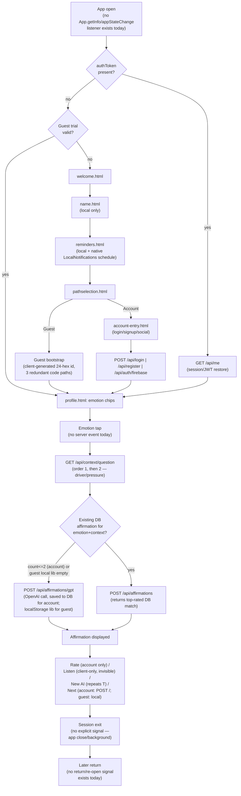

# Product Analytics — Current State

Status: **analysis only, no code/DB changes made**
Repo analyzed: `/Users/ritusharma/affirmations-app` (branch `develop`, as checked out 2026-07-27)
Companion docs: [PRODUCT_ANALYTICS_ARCHITECTURE.md](PRODUCT_ANALYTICS_ARCHITECTURE.md) · [PRODUCT_ANALYTICS_FUNCTIONAL_SPEC.md](PRODUCT_ANALYTICS_FUNCTIONAL_SPEC.md)

> **Read this before the rest of the analytics doc set.** This app's local backend code has a documented, unresolved trust problem (see §0). Every "current state" claim below about the *backend* is qualified as "observed in this checkout" rather than "confirmed deployed," and cross-checked against what the client actually calls over the network wherever possible.

---

## 0. A load-bearing caveat: this checkout is not reliable ground truth for the backend

Per `docs/incident-my-affirmations-backend-drift.md` and `docs/Technical-FAQ-and-Troubleshooting.md`, the authoritative backend lives in a separate repo (`affirmations-app-server`) not cloned on this machine, deployed to EC2 DEV/PROD, and DEV additionally runs a **second** service (`innerguide-auth`, port 3002) that has no representation in this checkout at all. The local `affirmations-app` repo's `server.js`/`routes/`/`models/` have previously drifted from what's actually deployed, and that drift was only caught by manual comparison.

Evidence this is still true today, found during this review: the client (`public/js/*`) makes fetch calls to endpoints that **do not exist anywhere in this checkout's `routes/` files** —

| Endpoint the client calls | Found in local `routes/`? |
|---|---|
| `GET /api/context/question` | No |
| `POST /api/auth/firebase` | No |
| `GET /api/emotions/dashboard` | No |
| `GET /api/support/daytime-notification-pool`, `GET /api/support/daytime-reset`, `POST /api/support/hide` | No |
| `GET /api/me`, `PATCH /api/me` | No |
| `POST /api/logout` | No |
| `POST /api/password/forgot`, `GET /api/password/validate`, `POST /api/password/reset` | No |
| `DELETE /api/account` (with `?dryRun=1`) | No |

Also, `routes/affirmations.js:6` does `require("../utils/jwt")`, but **no `utils/` directory exists in this checkout at all** — the file would not boot as-is. `models/User.js`, `models/Affirmations.js`, `models/EmotionLog.js` are Mongoose schemas, but `server.js` and every `routes/*.js` file use the native MongoDB driver's `db.collection(...)` directly — the Mongoose models are not `require`'d or used anywhere; they appear to be an older or parallel approach, not what's live.

**Implication for this analytics effort:** the architecture, API, and data-model proposals in this doc set are grounded in (a) the local backend where it's internally consistent, and (b) the client's actual call sites, which are a more reliable proxy for the real deployed API surface than the local `routes/` folder. Anywhere this matters, it's flagged as **[VERIFY AGAINST DEPLOYED BACKEND]**. This should be treated as a standing precondition for implementation, not just a documentation footnote — Phase 0 in the [implementation plan](PRODUCT_ANALYTICS_IMPLEMENTATION_PLAN.md) includes reconciling against the real `affirmations-app-server` repo before any analytics backend work starts.

---

## 1. Current-state architecture review

### 1.1 Application architecture
- Frontend: server-rendered-free static HTML + vanilla JS under `public/` (no framework, no bundler for app code — `public/js/capacitor.bundle.js` is an esbuild bundle of just the Capacitor plugin glue, built via `tools/inject-capacitor-bundle.js` / `npm run inject:cap`).
- Mobile shell: **Capacitor** wraps `public/` for iOS (`ios/`) and Android (`android/`). `capacitor.config.json`: `appId: com.innerguideai.app`, `webDir: public`, plugins `Browser`, `FirebaseAuthentication` (Google + Apple providers).
- `public/` is the single source of truth; `ios/App/App/public/` and `android/.../assets/public/` are generated copies (via `npx cap copy` / `scripts/sync-web-to-ios.sh`) and must never be hand-edited (per `AI_WORKFLOW_RULES.md` Rule 4).
- No SPA router — each screen is its own `.html` file with its own `<script>` includes; navigation is plain `location.href` redirects.

### 1.2 Backend framework
- Node.js + **Express 5** (`server.js`), native **MongoDB driver** (`mongodb` npm package) — not Mongoose in practice, despite `models/*.js` existing as Mongoose schemas.
- Route modules under `routes/` are factory functions taking `db` and returning an `express.Router()`: `auth.js`, `affirmations.js`, `emotions.js`, `admin.js`, `clear.js`, `streaks.js`, `export.js`, `music.js` (`server.js:80-94`).
- Per DEV topology documented in `docs/Technical-FAQ-and-Troubleshooting.md`, DEV actually runs **two** Node services: this "main app" server (port 3000) and a separate `innerguide-auth` service (port 3002) handling Google/Apple/Firebase sign-in — the latter is not present in this repo at all.

### 1.3 Database technology
- MongoDB, database name `affirmationsDB` (`server.js:19,66`), connected via `mongodb://localhost:27017` (i.e. the app server and Mongo run on the same DEV host).
- Confirmed collections referenced in code: `users`, `affirmations`, `emotionlogs` (note: lowercase, no underscore — `routes/affirmations.js:43`, `routes/emotions.js:7`), `reflections` (`routes/streaks.js:89`, `routes/export.js:126`). `routes/clear.js:8` references `emotionLogs` (different casing) — a latent bug/inconsistency, not a second collection.
- No `events`, `analytics`, or `telemetry` collection exists anywhere.

### 1.4 Authentication model
- Hybrid: session cookie (`req.session?.user?.id`, referenced in `routes/affirmations.js:18` but **no session middleware is registered in `server.js`** — `express-session` is not in `package.json` and `app.use(session(...))` doesn't appear — so `req.session` would be `undefined` in this checkout) **and** a Bearer JWT fallback via `verifyUserToken` (module missing locally, see §0).
- Client-observed reality (`public/js/profile.api.js`, `login.js`, `social-auth.js`): the client stores an `authToken` (JWT) via `window.secureStore` (Keychain-backed, `public/js/secure.store.js`) and sends `Authorization: Bearer <token>` plus `credentials:"include"` — so the deployed backend supports both cookie session and Bearer JWT, consistent with `resolveAuthenticatedUserId()`'s dual-path logic in `routes/affirmations.js:17-34`, even though the session half isn't wired in this checkout.
- Three sign-in paths exist client-side: email/password (`POST /api/login`, `POST /api/register`), Google/Apple via Firebase (`POST /api/auth/firebase` after native `FirebaseAuthentication` token exchange), and **guest mode** (no backend auth call at all — a locally-generated 24-hex id is treated as a first-class `userId`).
- Password reset: `POST /api/password/forgot`, `GET /api/password/validate`, `POST /api/password/reset` — none present locally **[VERIFY AGAINST DEPLOYED BACKEND]**.
- Email verification gate exists client-side (`login.js`'s `pendingVerify`/`verify-required.html` flow) implying a `403 EMAIL_NOT_VERIFIED` response class from the deployed backend, not observable in this checkout.

### 1.5 User identifier strategy
- The application's user id is a MongoDB `ObjectId` (24-hex string), used identically whether the user is a registered/social-auth account or a **guest**. Guest ids are generated client-side (not server-issued) via one of **three independent, redundant code paths** that all converge on a 24-hex string and all write the same localStorage keys (`currentUserId`, `currentUser`, `ig_auth_mode`):
  1. `public/js/pathselection.js` — SHA-256 of a persisted device seed (`ig_guest_seed_v1`).
  2. `public/js/guest.trial.js`'s `igStartGuestTrial()` — random 24-hex, reused if already present.
  3. `public/js/profile.init.js`'s inline guest-normalization block — also random 24-hex, reused if present.
- This means **guest identity today is already a persistent, device-scoped pseudonymous id** (survives across app opens on the same device, expires only with the 7-day guest trial or app data being cleared) — not truly anonymous, and not currently treated with any privacy safeguards. This is directly relevant to analytics identifier design (see [ARCHITECTURE.md §5](PRODUCT_ANALYTICS_ARCHITECTURE.md#5-identifier-design)).
- On login/social-auth, the client also independently manages a persistent **device id** (`ig-device-id`, Keychain-backed via `secure.store.js`) for a legacy guest-id-rewrite compatibility path in `profile.api.js` — mostly dead code today (the header that would send it is commented out at `profile.api.js:162`).
- Social login (`social-auth.js`) response includes both `user.appUserId` (the app-local Mongo id used as `currentUserId`) and a comment referencing a separate `globalUserId` — implying the backend already has a notion of a **cross-app identity** distinct from the per-app user id, consistent with the sibling `innerguide-auth` service existing for shared Google/Apple sign-in across apps.

### 1.6 Session model
- No server-side session store observed (no `express-session`, no Redis/Mongo session backing in `package.json` or `server.js`). Practical session model is **client-held JWT + cookie**, with the JWT being the reliable half in this checkout.
- No concept of an analytics-style "app session" (start/end, timeout) exists anywhere today, client or server.

### 1.7 API structure
Mounted under `server.js:80-94`, all prefixed `/api` except `/admin`:
- `/api/*` → `auth.js` (`POST /login`, `POST /register`)
- `/api/affirmations/*` → `affirmations.js` (`POST /`, `GET /next`, `POST /gpt`, `POST /rate`, `POST /unsave`, `GET /saved`, `POST /clear`, `GET /count`)
- `/api/affirmations/clear/*` → `clear.js` (`GET /clear`, `DELETE /clearall`) — note the double-mount: `clear.js`'s router is mounted at both `/api/affirmations/clear` (`server.js:82`) and effectively shares route-table space with `affirmations.js`'s own `POST /clear`; this is an existing naming collision risk, not an analytics concern per se, but worth knowing if instrumenting "clear" as an event.
- `/api/emotions/*` → `emotions.js` (`POST /`, `GET /top`, `GET /repeated`, `GET /debug`, `GET /patterns`)
- `/api/streaks/*` → `streaks.js` (`POST /reflection`, `GET /`)
- `/api/export/*` → `export.js` (`GET /`)
- `/api/music/*` → `music.js` (`GET /search`, `GET /recommendations` — Spotify passthrough, unrelated to the core journey)
- `/admin/*` → `admin.js` (`GET /users`, `GET /emotions`, `GET /affirmations`, `GET /mock`) — **no auth guard on any admin route in this checkout**; flagged in [PRIVACY_SECURITY.md](PRODUCT_ANALYTICS_PRIVACY_SECURITY.md) as a pattern any new admin/reporting API must not repeat.
- Endpoints called by the client but absent locally are listed in §0 — these represent the real API surface as experienced by users and should be treated as in-scope for analytics instrumentation planning even though this repo can't confirm their server-side implementation.

### 1.8 Existing logging or analytics
**None.** Confirmed by exhaustive grep (both by this session and an Explore sub-agent) across `package.json`, `Podfile`/`Podfile.lock`, `android/app/build.gradle`, and every first-party JS file: no Amplitude, Mixpanel, Segment, PostHog, Sentry, Firebase Analytics, or `gtag` integration exists. `capacitor.bundle.js` transitively bundles the Firebase JS SDK's `@firebase/analytics` package (because `@capacitor-firebase/authentication` depends on core Firebase JS), but it is **never initialized or called** — inert vendor payload, not live telemetry.
- `docs/qa/release-checklist-rls-003.md` explicitly lists "Sentry / APM" under a deferred/non-blocking section — the one documented signal that observability tooling is a known, intentional gap rather than an oversight.
- Backend logging is 54+ ad-hoc `console.log`/`console.error` calls, emoji-prefixed, unleveled, no log library. **`server.js:43` logs the raw `OPENAI_API_KEY` to stdout on every boot** — a pre-existing secret-exposure issue that must be fixed (or the offending line excluded) before any log-shipping/observability pipeline is connected to backend output, so it doesn't get exfiltrated into a log aggregator.
- Frontend "event-ish" signals (streaks, top emotions, GPT quota, support-nudge triggers) are all inferred from `localStorage` state client-side — nothing is ever transmitted as a discrete event to any backend.

### 1.9 Existing app-version and platform information
- **Not captured anywhere at runtime.** iOS `Info.plist` resolves `CFBundleShortVersionString`/`CFBundleVersion` from Xcode build settings (`MARKETING_VERSION=1.6.0`, `CURRENT_PROJECT_VERSION=4`, per `ios/App/App.xcodeproj/project.pbxproj:379,388,390`); Android's `build.gradle` sets `versionCode 2` / `versionName "1.5"` independently. Neither value is ever read by client JS and sent to the backend — the bundled `@capacitor/app` plugin's `App.getInfo()` exists in `capacitor.bundle.js` but is never called by first-party code (`capacitor.entry.js` only uses `App.addListener("appUrlOpen", ...)` for the password-reset deep link).
- **Known, tracked bundle-id mismatch**: `capacitor.config.json` / Android `applicationId` = `com.innerguideai.app`, but the actual compiled iOS bundle id (`project.pbxproj`, `GoogleService-Info.plist`) and the Appium test target = `com.innerguide.aiaffirm`. `docs/qa/release-checklist-rls-003.md` already tracks this as a pre-archive gate. Any analytics platform/dashboard keyed by bundle id or "platform" must account for this until it's resolved — do not assume the two platforms share one canonical app identifier today.
- Backend endpoint is one of three known targets (`scripts/switch-api-env.sh`): DEV (`54.221.158.219:3000`), PROD-A (`api.innerguideai.com`), PROD-B (`api-b.innerguideai.com`) — relevant for environment tagging on any event.

### 1.10 Existing affirmation-generation flow
See full detail in [§2 Journey Mapping](#2-current-journey-mapping). Summary: two sources — GPT (`POST /api/affirmations/gpt`, OpenAI `gpt-3.5-turbo`, `routes/affirmations.js:217-310`) and DB-cached (`POST /api/affirmations`, returns highest-rated matching doc or `404` if none exist for that emotion+context). Client decides which to call based on `GET /api/affirmations/count` (≤2 existing docs for that emotion/driver/pressure ⇒ call GPT). **Guest mode never touches these two account endpoints** — it maintains its own affirmation library entirely in `localStorage` (`ig_guest_affs_v1_<emotion>`), calling only `POST /api/affirmations/gpt` when that local library is empty.

### 1.11 Existing onboarding flow
`welcome.html → name.html → reminders.html (onboarding mode) → pathselection.html → (guest: profile.html | account: account-entry.html)`. All local-only (no API calls) except the eventual guest/account divergence. No server-side signal exists that onboarding started, progressed, or completed — it's entirely inferable (if at all) from which localStorage keys exist, and only if something reads them later, which today nothing does. `firstaffirmation.html`/`firstaffirmation.js` exists but is **orphaned** — not linked from any other page.

### 1.12 Existing rating, saving, listening, insight, and New AI flows
- **Rate**: `POST /api/affirmations/rate` (account only; guests never rate — stars hidden).
- **Save**: implicit — every GPT/DB affirmation returned to an account user is already persisted (`affirmations` collection); "My Affirmations" (`GET /api/affirmations/saved`) just lists the last 30 days, not-removed. There's no explicit "save" action distinct from receiving an affirmation, except **unsave** (`POST /api/affirmations/unsave`, soft-hide flag).
- **Listen**: 100% client-side (`window.speechSynthesis`), no backend call, therefore invisible to any server-side signal.
- **New AI**: `POST /api/affirmations/gpt` again, explicitly, from the "New AI" button — client-enforced daily quota (`ig_gpt_daily_v1:*` in localStorage, 3/day guest, 10/day account) with **no server-side enforcement or visibility** of that quota.
- **Insight**: `emotion-dashboard.html`/`emotion-dashboard.js` → `GET /api/emotions/dashboard` (not present locally, **[VERIFY AGAINST DEPLOYED BACKEND]**) returning summary + chart data; a "Monthly Insight" card is the closest thing to a proactive insight surface today.

### 1.13 Account-deletion implementation
Client-observed (`public/account.html` inline script): `DELETE /api/account?dryRun=1` (preview counts) then `DELETE /api/account` (real delete) — **not present in local `routes/`**, so its exact server-side behavior (hard delete vs. soft delete, what happens to `emotionlogs`/`reflections`/`affirmations`) cannot be confirmed from this checkout. `routes/clear.js`'s `DELETE /clearall?userId=` is a *different*, dev/test-only route that hard-deletes `affirmations` + `emotionlogs` + the `users` doc for a given id — it is **not** wired to the account-deletion UI and looks like a debug utility, not the production deletion path. This distinction matters a great deal for the analytics [account-deletion linkage design](PRODUCT_ANALYTICS_PRIVACY_SECURITY.md) — **[VERIFY AGAINST DEPLOYED BACKEND]** before assuming either behavior.

### 1.14 Error-handling and monitoring architecture
None beyond try/catch-and-console.error per route, returning generic `5xx` JSON. No centralized error handler, no request-id/correlation-id generation, no APM. Confirmed as an intentional, tracked gap ("Sentry / APM" deferred item in the release checklist).

### 1.15 Deployment architecture relevant to analytics
- DEV: main app server on port 3000 (plain `node server.js`, **not PM2-managed** — a documented operational risk, since a box reboot silently drops it), plus a separate PM2-managed `innerguide-auth-dev` service on port 3002. Same-host MongoDB.
- PROD: `api.innerguideai.com`, separate EC2 host, `main` branch.
- DEV reachability has a documented history of breaking when the developer's residential IP changes (Security Group rule tied to a dynamic IP) — relevant because any analytics ingestion endpoint added to this same backend inherits the same availability risk on DEV.
- No queue, cache, or background-job infrastructure exists today (no Redis, no Bull/BullMQ, no cron mentioned) — any async aggregation job would be new infrastructure, not a reuse of something existing.

### 1.16 Any existing admin or reporting capability
`routes/admin.js` (`/admin/users`, `/admin/emotions`, `/admin/affirmations`, `/admin/mock`) — raw collection dumps, capped at 100 docs for logs/affirmations, **no authentication**, no aggregation, no pagination beyond the hardcoded limit. This is the entire "reporting" surface that exists today. It is not a reporting API in any meaningful sense and must not be the template for a new analytics reporting API (see [PRIVACY_SECURITY.md](PRODUCT_ANALYTICS_PRIVACY_SECURITY.md) access-control requirements).

---

## 2. Current journey mapping

### Existing server-visible steps
- Login/register/social-auth calls, `GET /api/me`, emotion-context fetch, affirmation GPT/DB calls, rate, unsave/saved list, streak reflection post, account deletion, password reset.

### Steps visible only to the client
- Onboarding progress (name/reminders/path selection), which emotion chip was tapped (only the *resulting* context-question fetch is server-visible, not the tap itself), Listen, New AI daily-quota gating, streak increment logic, guest-mode's entire affirmation lifecycle (generate/store/rotate all in `localStorage`), theme choice, tour completion, notification enable/disable state.

### Steps currently impossible to measure (client or server)
- **App open / app foreground** as a discrete event — no `App.getInfo()`/`appStateChange`/`resume` listener is wired anywhere.
- **Session start/end** — no concept of a bounded session exists in the app today.
- **Return visits** — nothing timestamps "last seen" in a way any dashboard reads.
- **Onboarding abandonment** — no step-progress signal reaches any server.
- **Time to first affirmation** — no timestamp captured at "app first installed"/"onboarding started" to compare against "first affirmation shown."
- **Listen** completely (client-only, no event of any kind).
- **App version / platform / OS version at the point of any action.**

### Where duplicate events could occur
- The **three redundant guest-bootstrap code paths** could each, if instrumented naively, fire a "guest created" event on every app open rather than once per install.
- `profile.emotions.js`'s carousel and `profile.init.js`'s footer chips both call `GET /api/emotions/top` independently on the same page load — a naive "insight viewed" event keyed to that endpoint would double-count.
- The client-side GPT daily-quota check and the server-side `count`-based GPT-vs-DB decision are two independent triggers that could both attempt to log an "affirmation_requested"-shaped signal for what a user experiences as one action.

### Where network loss or retries could produce inaccurate counts
- Any fetch in `profile.affirmations.js` (GPT generation, rating, DB fetch) has no visible client-side retry/backoff logic today; a dropped response after a server-side write (e.g., GPT affirmation already inserted, but the response never reaches the client) would look to the user like nothing happened, and a naive "affirmation_generated" event fired only on a successful response would under-count relative to what was actually written to Mongo.
- Guest mode's local-only affirmation library means anything guest-side is never visible to the backend at all regardless of network conditions — any analytics events for guest actions must be captured and queued client-side, not inferred from server writes.

---

## 3. Gap analysis

| Desired metric/event | Measurable today? | Existing data source | Current limitation | Proposed change | Privacy risk | Phase |
|---|---|---|---|---|---|---|
| App opens | No | None | No app-open/lifecycle hook wired | Add `App.getInfo()`/`appStateChange` listener, emit `app_opened` | Low (no PII) | 1 |
| New vs. returning users | No | None | No install/first-open timestamp stored anywhere | `installId` + first-seen timestamp in new analytics store | Low | 1 |
| Onboarding start/complete/abandon | No | None (steps are pure client nav) | No step-progress signal reaches server | Client emits `onboarding_started`/`onboarding_step_completed`/`onboarding_completed` | Low | 1 |
| Emotion selected | Partially (inferred) | `emotionlogs` collection (server), but only logged on affirmation fetch/GPT call with `shouldLog`, not on the raw chip tap | Conflates "emotion tapped" with "affirmation flow triggered"; broad emotion text stored verbatim in Mongo today (not analytics-safe) | New `emotion_selected` event with **broad category only**, decoupled from `emotionlogs` PII collection | Medium — existing `emotionlogs.emotion` is free-form text; must map to a fixed category enum for analytics, never copy verbatim | 1 |
| Affirmation received successfully | Partially | Response from `POST /api/affirmations` / `/gpt` | No distinction recorded between GPT vs. DB-fallback vs. failure at the data layer | `affirmation_generated` with `source` property (ai/db/local_fallback) | Low if text excluded | 1 |
| Affirmation generation failures | No | None — only a `console.error` on the server | Failures aren't recorded anywhere, only logged to stdout | `affirmation_generation_failed` with failure category, no stack trace/user input | Low | 1 |
| View / rate / save / listen | Rate: yes (DB write). View/Save/Listen: no | `affirmations.rating` field | "Save" isn't a distinct action server-side; Listen is invisible; View is inferred, never recorded | `affirmation_viewed`, `affirmation_saved`, `affirmation_listened` as first-class events | Low | 1–2 |
| New AI requested | Partially | Same endpoint as first-generation, no differentiation | Can't tell "first AI affirmation" from "New AI button" from the DB row alone | `new_ai_requested` event, client-differentiated by UI trigger | Low | 1 |
| Funnel abandonment point | No | None | No per-step signal | Funnel events + reporting logic on top of the new event stream | Low | 2 |
| Time to first affirmation | No | None | No first-open timestamp exists to diff against | Derived metric: `affirmation_generated.occurredAt − installId.firstSeenAt` | Low | 2 |
| D1/D7/D30 return | No | None | No returning-user concept exists | Derived from `analyticsUserId` event timestamps + activation flag | Medium — requires careful timezone/definition rules (see [Metrics](PRODUCT_ANALYTICS_METRICS.md)) | 2 |
| Feature adoption (rate/save/listen/new-AI frequency) | Partial (rate only, via DB) | `affirmations.rating` | No listen/save-frequency signal at all | Event-based counts per `analyticsUserId` | Low | 2 |
| App-version/platform reliability breakdown | No | None | Version/platform never transmitted | Add `appVersion`/`buildNumber`/`platform` to every event envelope | Low | 1 |
| Campaign → activation → retention | No | None | No campaign/referral identifiers exist anywhere in the app | New attribution layer (links, "how did you hear about us") — see [Architecture §Attribution](PRODUCT_ANALYTICS_ARCHITECTURE.md#11-attribution-architecture) | Medium — must not conflate named outreach records with anonymous analytics | 3 |
| Account deletion → analytics linkage cleanup | No | Unknown server behavior (`DELETE /api/account` not in this checkout — **[VERIFY AGAINST DEPLOYED BACKEND]**) | Can't currently reason about what deletion does to any linked data | New identity-linkage table with an explicit delete hook | High if unaddressed — this is the single biggest privacy risk in the whole design | 1 (design), 2 (build) |

---

## Assumptions and open questions carried into the rest of this doc set
- **[ASSUMPTION]** The deployed backend (EC2 DEV/PROD, `affirmations-app-server`) has real implementations of every endpoint the client calls, even though this checkout doesn't. All architecture proposals treat those endpoints as real but unverified integration points.
- **[OPEN QUESTION]** What does `DELETE /api/account` actually do server-side today (hard delete vs. soft delete, which collections)? This materially affects the account-deletion → analytics-linkage design in [PRIVACY_SECURITY.md](PRODUCT_ANALYTICS_PRIVACY_SECURITY.md).
- **[OPEN QUESTION]** Is `innerguide-auth` (the sibling cross-app identity service) intended to eventually be the system of record for a cross-app `analyticsUserId`, given it already issues a `globalUserId`? Not assumed in this design, but worth a product decision — see [DECISIONS_AND_RISKS.md](PRODUCT_ANALYTICS_DECISIONS_AND_RISKS.md).
